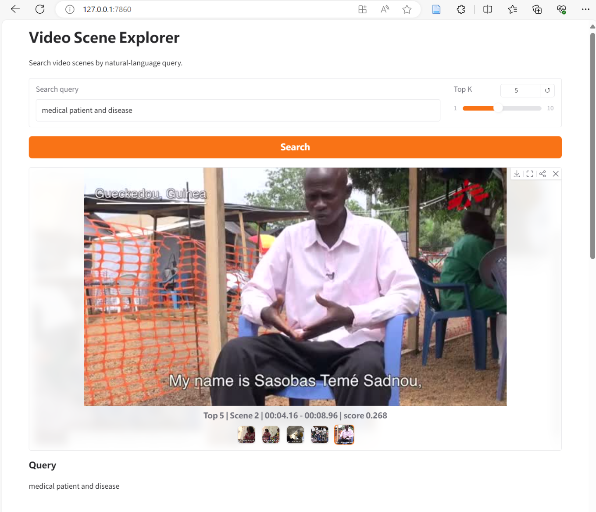

# Video Scene Explorer

Minimal starter workflow for a media-tech demo:

1. Put your processed files into `data/raw/`
2. Transcribe the audio with Whisper
3. Align transcript segments to PySceneDetect scenes

## Expected files

Put these files under `data/raw/`:

- `video.mp4`
- `audio.mp3`
- `video-Scenes.csv`

## Install

```powershell
pip install -r requirements.txt
```

## Transcribe audio

```powershell
python scripts/transcribe_audio.py data/raw/audio.mp3 --model base --language English --output data/processed/transcript.json
```

## Align scenes and transcript

```powershell
python scripts/align_scenes.py data/raw/video-Scenes.csv data/processed/transcript.json --output data/processed/scene_transcripts.json
```

## Next step

After `scene_transcripts.json` is created, extract one keyframe per scene and then build simple query retrieval over the scene transcripts.
## Demo


